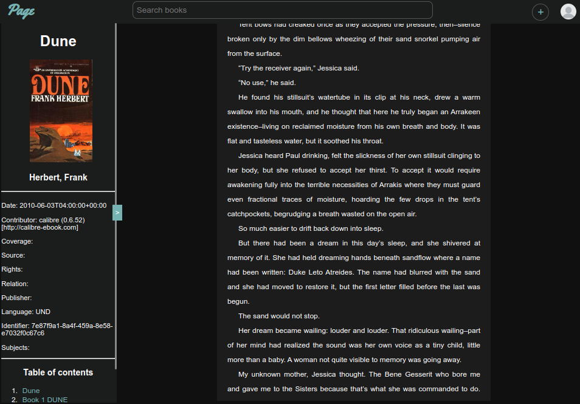

# Page
***An elegant ebook reader and discovery platform***  




## Project status:
--This project is currently still actively being developped.--  
The basic minimal viable product for this app is 
complete (which includes the ability to upload and read books).
However, I want to go work on something else. So, Page will
remain available, but I'll come back to the project eventually.

## Goals:
- Cross platform experience
- The ability to search and buy different ebooks
- Interoperate with different services (Amazon, Apple itunes, Google Play ...)
- Speech to text for a authentic audiobook experience
- Nice app UI/UX, especially for the ebook paginated rendering

## Setup and Information:
Page's tech stack:
- Backend: Golang
- Frontend: Svelte and Typescript
- Database: Postgresql
Make sure you have all those components installed.
The latest software package will suffice.

To setup dev environment:
```bash
git clone https://github.com/aabiji/page.git
cd page
./setupdb.sh # Run database setup script
cd backend
go mod tidy  # Install all backend dependencies
cd ..
cd frontend
npm install  # Install all frontend dependencies
```

To run the app you can use the ```runservers.sh``` script.
In a dev environment however, you probably don't want to run
the servers as a background process.  
Instead run the frontend server:
```bash
cd frontend
npm run dev
```
And the backend server:
```bash
cd backend
go run .
```

## Liscense
Page is liscensed under the MIT liscense. Feel free to contribute!