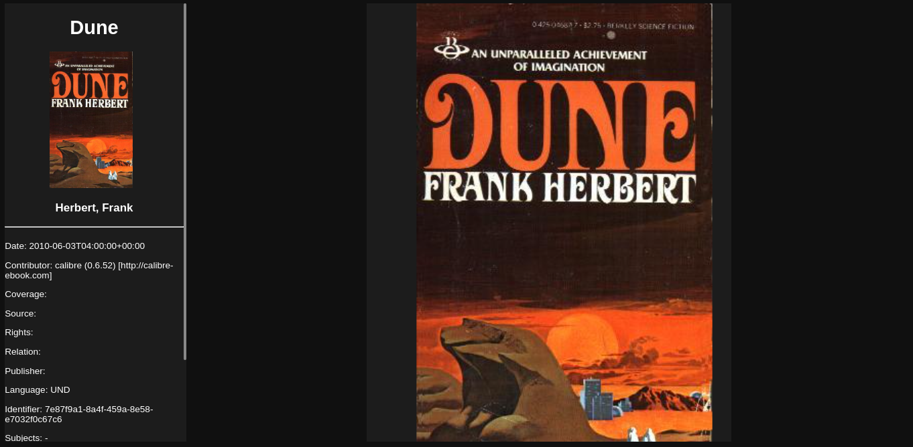

# Page
***A elegant ebook reader and discovery platform***  
Page is an elegant ebook reader and discovery app. It uses svelte with typescript for the frontend, 
go for the backend and postgresql for the database (maybe we'll use firebase cloud storage????).

Goals:
- Cross platform experience
- The ability to search/buy different ebooks
- Speech to text for a authentic audiobook experience
- Nice app UI/UX, especially for the ebook paginated rendering
- Interoperate with different services (Amazon, Apple itunes, Google Play ...)

Todo:
- fix links in rendered epub file
- better scrolling with images
- don't want to be scrolling images -- fit height to container
- default cover image for epub that doesn't have one
- default utf-8 encoding for all epub files (think of -? in Dune rendering)

This project is currently still actively being developped.

