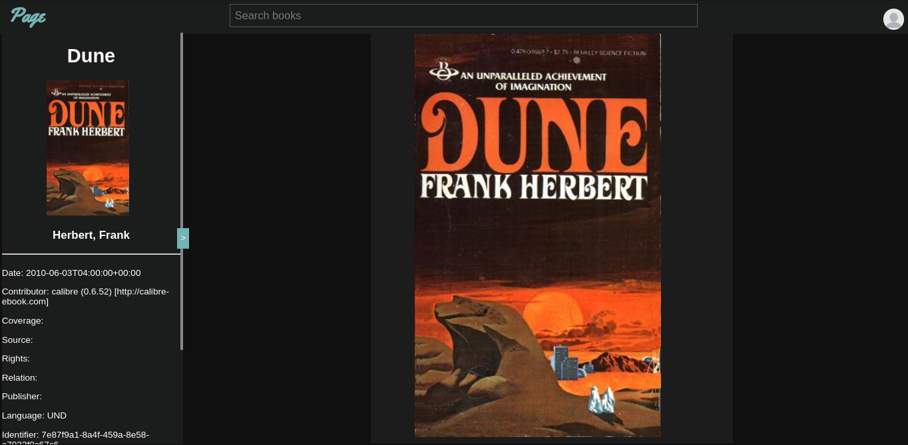

# Page
***An elegant ebook reader and discovery platform***  
Page is an elegant ebook reader and discovery app. 
It uses Svelte with Typescript for the frontend, 
Go for the backend REST API and Postgresql as the database.

Goals:
- Cross platform experience
- The ability to search/buy different ebooks
- Speech to text for a authentic audiobook experience
- Nice app UI/UX, especially for the ebook paginated rendering
- Interoperate with different services (Amazon, Apple itunes, Google Play ...)

TODO;
- Fix account already exists error when server panics
- Better frontend error handling
- Log backend errors
- Cache book info in localStorage
- Render appropriate book title and cover image
- Don't call backend api if book info is already in cache
- Call backend api to update user book info when on dom page event
- fix image url bug from atomic habits
- basic user settings page
- dynamic ui css
- long duration session cookies

This project is currently still actively being developped.
