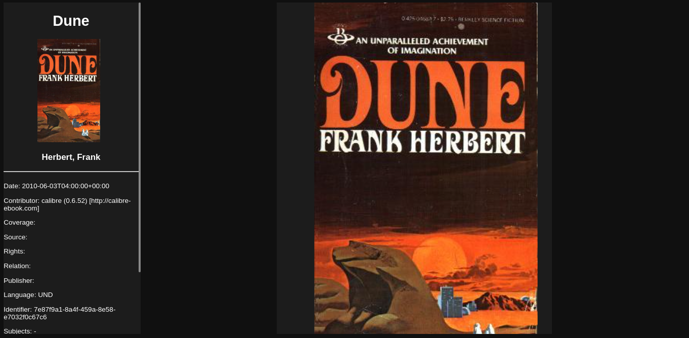

# Page
***A elegant ebook reader and discovery platform***  
Page is an elegant ebook reader and discovery app. It uses svelte with typescript for the frontend, 
go for the backend and postgresql for the database (maybe we'll use firebase cloud storage????).

Goals:
- Cross platform experience
- The ability to search/buy different ebooks
- Speech to text for a authentic audiobook experience
- Nice app UI/UX, especially for the ebook paginated rendering
- Interoperate with different services (Amazon, Apple itunes, Google Play ...)

Todo:
- fix links in rendered epub file
- mock users book storage (using sqlite as the demo db for now)
- http request to get user books from database
- start user collection ui

This project is currently still actively being developped.

